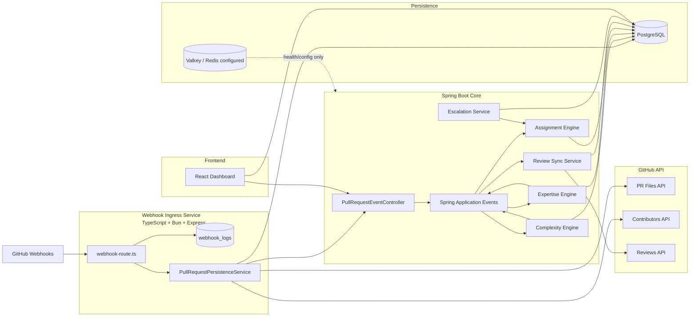
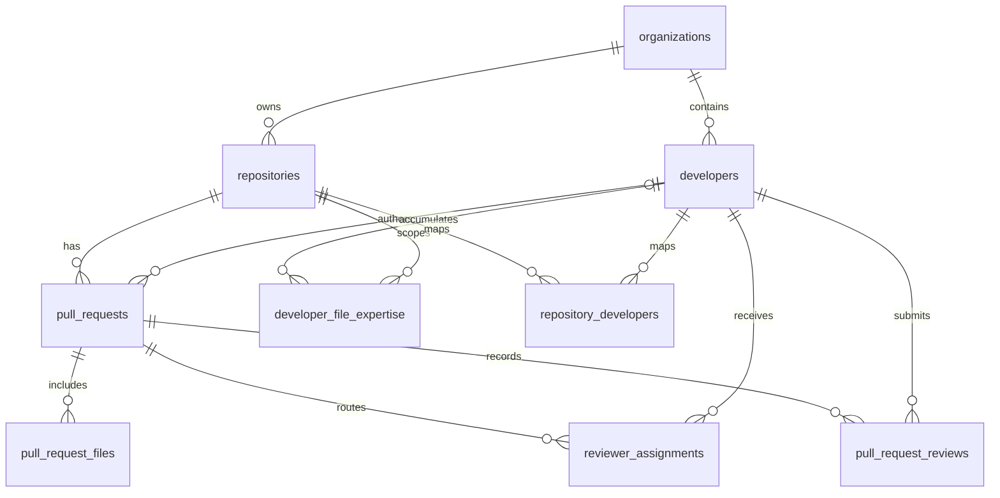
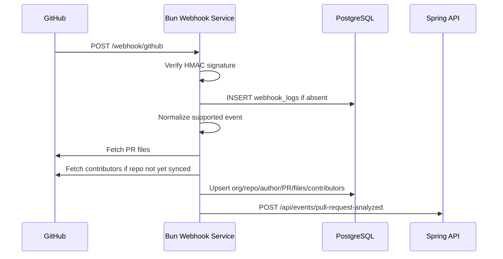
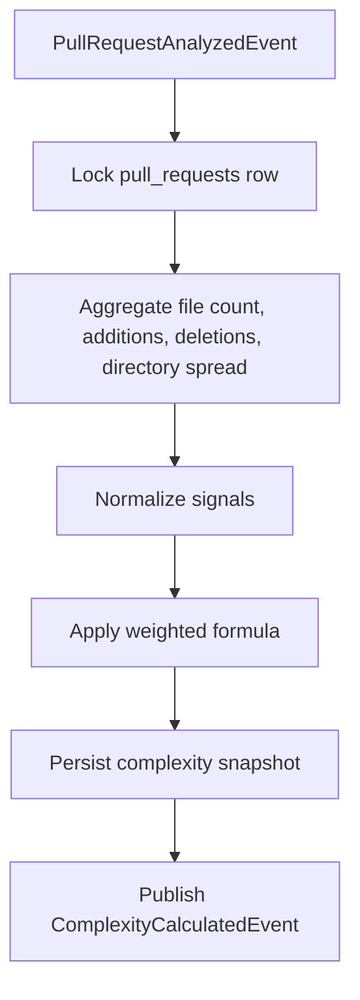
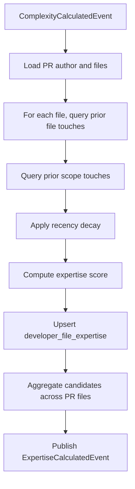
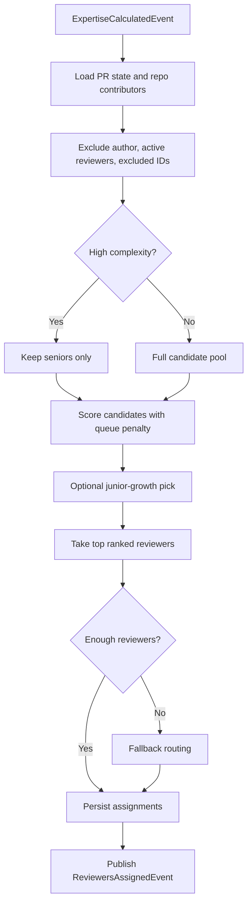
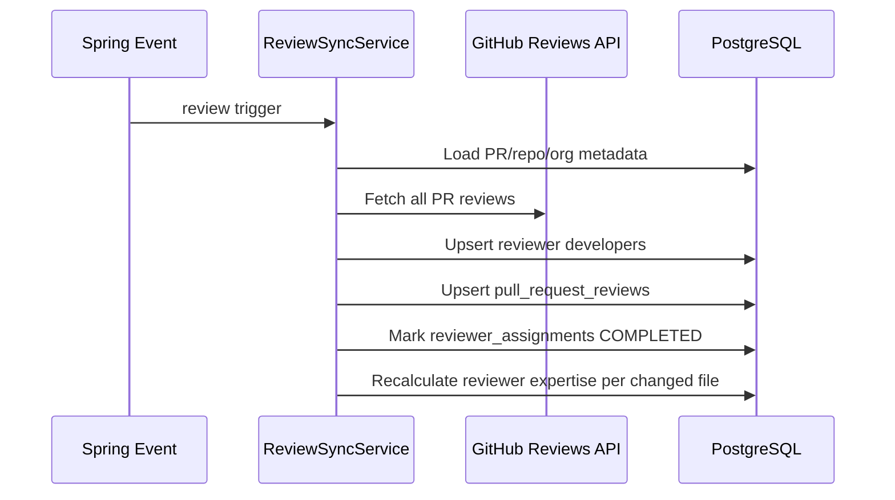
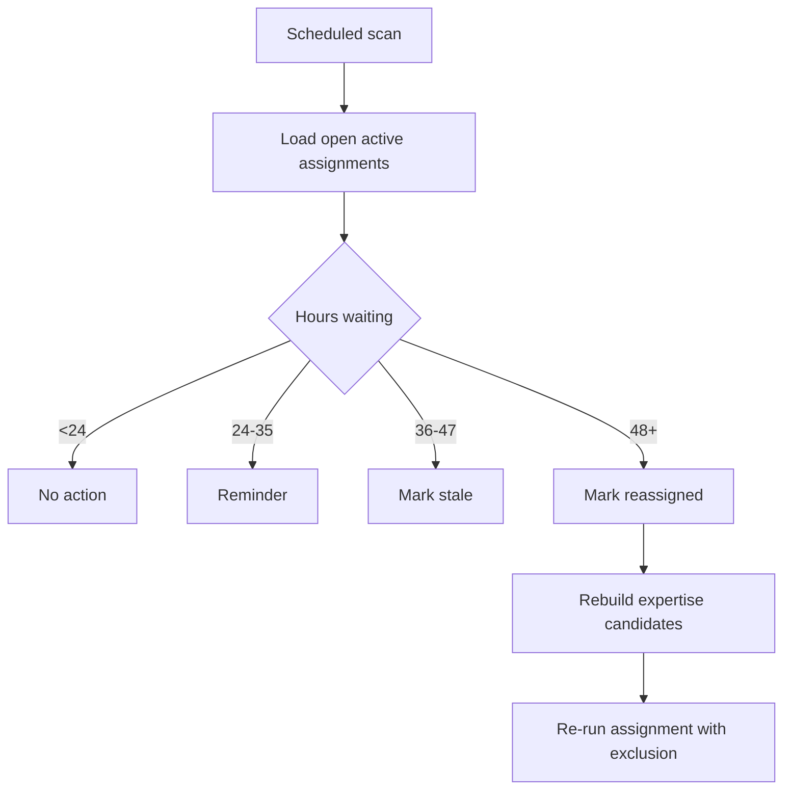

# PRFlow Project Overview

## 1. Project Summary

### Plain-language version
PRFlow is a pull request workflow coordinator for engineering teams. Instead of relying on people to manually find reviewers and chase stalled reviews, it listens to GitHub activity, tracks who knows which parts of the codebase, assigns reviewers automatically, and escalates stuck reviews before delivery slows down.

### Technical version
PRFlow is an event-driven pull request orchestration platform built as a small monorepo:
- A Bun/Express GitHub webhook ingress verifies signatures, normalizes events, persists raw deliveries, and writes PR state into PostgreSQL.
- A Spring Boot backend runs synchronous internal workflow engines for complexity scoring, expertise modeling, reviewer assignment, review synchronization, and SLA escalation.
- A React/Vite dashboard currently acts mostly as a lightweight console/demo shell over backend state.

The core design choice is to treat GitHub as the source of repository events and review data, while PRFlow owns workflow intelligence and operational state.

## 2. Architecture Overview

### What is actually implemented
- **Ingress path:** GitHub webhook -> Bun service -> PostgreSQL persistence -> POST into Spring event gateway.
- **Workflow path:** Spring controller publishes application events; engines chain via synchronous event listeners.
- **Persistence:** PostgreSQL is the real system of record for workflow state.
- **Cache/queue layer:** Redis/Valkey is configured in infra and Spring health checks, but no meaningful queue/cache workflow is implemented yet.
- **Frontend:** mostly static pages plus onboarding/status endpoints; not a full operational console yet.

## 3. Database Schema

### Entity notes
- `organizations`: GitHub installation/tenant boundary.
- `developers`: normalized contributor/reviewer identities with capacity and seniority metadata.
- `repositories`: repository registry under each organization.
- `webhook_logs`: idempotency/audit table keyed by GitHub delivery ID.
- `pull_requests`: canonical PR record with lifecycle and derived complexity fields.
- `pull_request_files`: file-level diff state used by complexity and expertise engines.
- `developer_file_expertise`: persistent memory of who knows which file/scope.
- `repository_developers`: contributor membership and contribution counts per repo.
- `reviewer_assignments`: reviewer routing decisions plus escalation state machine.
- `pull_request_reviews`: synchronized GitHub review history for expertise enrichment and assignment completion.

## 4. Core Workflows

### A. Webhook Ingestion and PR Persistence
**Code:** `integrations/github-webhook-service/src/http/webhook-route.ts`, `src/services/pr-persistence-service.ts`

**What it does**
- Verifies GitHub HMAC signatures.
- Parses supported webhook payloads with Zod.
- Deduplicates deliveries through `webhook_logs`.
- Fetches PR files and contributors from GitHub.
- Upserts organization, repository, developer, PR, and PR files into PostgreSQL.
- Emits the next internal event once DB primary keys exist.

**Inputs**
- Raw GitHub webhook body and headers.

**Outputs**
- Persistent workflow state in Postgres.
- A forwarded `pull-request-analyzed` event into Spring.

### B. Complexity Engine
**Code:** `backend/spring-api/.../ComplexityService.java`, `ComplexityCalculator.java`

**What it does**
- Locks the PR row.
- Aggregates diff signals from `pull_request_files`.
- Produces a deterministic complexity score and level.
- Persists the derived snapshot on the PR.

**Algorithm**
- File count is bucketed into low/medium/high tiers.
- Additions and deletions are normalized against high-water marks.
- Unique directory spread is separately bucketed.
- Final score = weighted diff score + weighted directory spread score.

**Inputs**
- `pull_request_files`, PR ID, repository ID.

**Outputs**
- `pull_requests.complexity_score`
- `pull_requests.complexity_level`
- `ComplexityCalculatedEvent`

### C. Expertise Engine
**Code:** `backend/spring-api/.../ExpertiseService.java`, `ExpertiseCalculator.java`

**What it does**
- Computes file- and scope-level familiarity for the PR author based on past authored work.
- Applies recency decay so older touches matter less.
- Upserts `developer_file_expertise`.
- Builds a ranked candidate list for assignment.

**Algorithm**
- For each file in the current PR:
  - Query prior PRs by the same author touching the same file.
  - Query prior PRs by the same author touching the same scope.
  - Convert each historical touch timestamp into a decay weight.
  - Normalize file and scope touch totals into a bounded score.
- Then aggregate expertise scores across all touched files by developer.

**Inputs**
- Current PR files, repository, author history.

**Outputs**
- Updated `developer_file_expertise`
- Ranked developer IDs and scores
- `ExpertiseCalculatedEvent`

### D. Assignment Engine
**Code:** `backend/spring-api/.../AssignmentService.java`, `AssignmentScoringService.java`

**What it does**
- Selects reviewers using expertise plus workload-aware scoring.
- Excludes the PR author, already-active reviewers, and explicit reassignment exclusions.
- Gates high-complexity PRs to senior reviewers only.
- Supports a configurable junior-growth path for low-complexity work.
- Falls back to less ideal routing if expertise coverage is sparse.

**Algorithm**
- Start from active repository contributors.
- Remove author and excluded IDs.
- If complexity exceeds threshold, keep only seniors.
- Score candidates with: `finalScore = expertise / (1 + activeReviews * penaltyWeight)`.
- Optionally inject one junior reviewer for growth.
- Fill remaining slots by ranked score.
- If still short, fallback to:
  - highest expertise candidate,
  - then any senior,
  - then most active contributor.

**Inputs**
- Candidate expertise event.
- Current reviewer load from `reviewer_assignments`.
- PR complexity.

**Outputs**
- Upserted `reviewer_assignments`
- `ReviewersAssignedEvent`

### E. Review Sync and Expertise Enrichment
**Code:** `backend/spring-api/.../ReviewSyncService.java`, `ReviewExpertiseEnricher.java`

**What it does**
- Fetches GitHub reviews for a PR using the installation token.
- Upserts reviewer identities and review records.
- Marks active reviewer assignments as `COMPLETED`.
- Rebuilds reviewer expertise from actual review participation and approvals.

**Inputs**
- Pull request ID.
- GitHub reviews API.

**Outputs**
- Updated `pull_request_reviews`
- Completed assignment statuses
- Enriched `developer_file_expertise`
- `ReviewsSynchronizedEvent`

### F. Escalation Engine
**Code:** `backend/spring-api/.../EscalationService.java`

**What it does**
- Periodically scans open assignments for SLA breaches.
- Advances assignments through reminder, stale, and reassignment states.
- Re-runs assignment logic for replacement reviewers when necessary.

**Algorithm**
- At `>=24h`: mark `REMINDER_SENT`.
- At `>=36h`: mark `STALE`.
- At `>=48h`: mark original assignment `REASSIGNED`, rebuild expertise candidates for the PR, and call assignment again with the stalled reviewer excluded.

**Inputs**
- Open PRs and active assignments.

**Outputs**
- State transitions on `reviewer_assignments`
- Notification side effects
- Potentially new reviewer assignments

## 5. Key Design Decisions

1. **Separate webhook ingress from workflow core**
   The Bun service handles signature verification and GitHub-facing normalization, while Spring owns business workflows. This reduces the blast radius of external protocol handling and keeps the orchestration code in one backend.

2. **Persist first, compute second**
   The system writes PR state to PostgreSQL before running engines. That makes downstream workflows replayable and explainable from DB state rather than relying on transient webhook payloads.

3. **Use idempotency at the delivery and row levels**
   `webhook_logs` deduplicates GitHub deliveries, while many upserts and `FOR UPDATE`/advisory locks make repeated processing safer. This is a strong choice for webhook-driven systems where duplicates are normal.

4. **Favor deterministic heuristics over black-box scoring**
   Complexity, expertise, and assignment formulas are simple and inspectable. That is easier to defend in interviews and easier to tune operationally than ML-style ranking.

5. **Model expertise at file and scope granularity**
   Using `developer_file_expertise` and `scope_identifier` gives finer routing than repository-level ownership. The trade-off is more write amplification and more expensive candidate aggregation queries.

6. **Apply workload-aware assignment rather than expertise-only routing**
   The queue penalty prevents the most knowledgeable reviewer from being overloaded forever. This intentionally trades perfect expertise matching for better team throughput.

7. **Escalate by state transitions, not ad hoc reminders**
   The escalation engine persists reminder/stale/reassigned states in `reviewer_assignments`. That is more robust than just sending notifications because the workflow can resume from state after failure.

8. **Use synchronous Spring application events inside the monolith**
   This keeps module boundaries explicit without introducing a real message broker yet. The trade-off is reduced decoupling and weaker isolation than an external queue would provide at scale.

## 6. Code Walkthrough

### Best files to screen-share
- [integrations/github-webhook-service/src/http/webhook-route.ts](/home/an/Desktop/dev/prflow/integrations/github-webhook-service/src/http/webhook-route.ts)
  This is the true ingress boundary: signature verification, payload parsing, dedupe, and dispatch.

- [integrations/github-webhook-service/src/services/pr-persistence-service.ts](/home/an/Desktop/dev/prflow/integrations/github-webhook-service/src/services/pr-persistence-service.ts)
  This is the bridge from GitHub event payloads into normalized relational state. If you understand this file, you understand how the whole pipeline gets seeded.

- [backend/spring-api/src/main/java/prflow/spring_backend/modules/pullrequest/controller/PullRequestEventController.java](/home/an/Desktop/dev/prflow/backend/spring-api/src/main/java/prflow/spring_backend/modules/pullrequest/controller/PullRequestEventController.java)
  This is the event gateway into Spring. It is intentionally thin and shows the architecture style clearly.

- [backend/spring-api/src/main/java/prflow/spring_backend/engines/assignment/service/AssignmentService.java](/home/an/Desktop/dev/prflow/backend/spring-api/src/main/java/prflow/spring_backend/engines/assignment/service/AssignmentService.java)
  This contains the most interview-friendly business logic: filtering, scoring, complexity gating, growth routing, and fallback handling.

- [backend/spring-api/src/main/java/prflow/spring_backend/engines/escalation/service/EscalationService.java](/home/an/Desktop/dev/prflow/backend/spring-api/src/main/java/prflow/spring_backend/engines/escalation/service/EscalationService.java)
  This shows how the system self-heals stuck reviews by turning SLA violations into state transitions and reassignment loops.

## 7. Likely Interview Questions

1. **Why not assign reviewers directly in GitHub?**  
   Because PRFlow wants its own replayable workflow state, expertise model, and escalation loop outside the VCS UI.

2. **How do you handle duplicate webhooks?**  
   `webhook_logs.delivery_id` is unique, and the ingress inserts only if absent before doing real work.

3. **What makes persistence replay-safe?**  
   The ingress uses upserts plus Postgres advisory locks; Spring complexity processing also checks whether complexity was already calculated.

4. **What happens if the same PR is opened twice or redelivered?**  
   The same PR row is upserted by `(repository_id, github_pr_number)`, files are replaced, and duplicate webhook deliveries are ignored.

5. **How is complexity computed?**  
   From file count, additions, deletions, and directory spread using fixed weights in `ComplexityCalculator`.

6. **Why weight additions more than deletions?**  
   The code assumes new logic generally costs more review effort than removing logic.

7. **How do you model developer expertise?**  
   By accumulating prior touches at both file and scope level, then decaying older activity so recent work matters more.

8. **Why store expertise instead of recalculating everything on demand?**  
   Persisted expertise makes routing explainable and avoids recomputing the full org history for every assignment.

9. **How are overloaded reviewers avoided?**  
   Assignment penalizes developers with more active reviews using a simple queue penalty multiplier.

10. **What happens for high-risk PRs?**  
    If complexity exceeds the configured threshold, only senior developers stay in the candidate pool.

11. **How do juniors still get growth opportunities?**  
    For lower-complexity PRs, the engine may deliberately inject one junior reviewer based on a configurable probability.

12. **What if there is no strong expertise match?**  
    The engine falls back to highest expertise available, then any senior, then the most active contributor.

13. **How are reviews synchronized back into the system?**  
    `ReviewSyncService` fetches reviews from GitHub, upserts them, and marks matching reviewer assignments completed.

14. **How does escalation work if a reviewer never responds?**  
    The assignment moves from `ASSIGNED` to `REMINDER_SENT` to `STALE` to `REASSIGNED`, and the engine reruns assignment excluding the stalled reviewer.

15. **Why use Spring application events instead of Kafka or SQS?**  
    This keeps the architecture simpler while preserving engine boundaries. It is a monolith with event-style module decoupling, not a distributed event bus.

16. **Where is Redis used?**  
    It is configured in infra and Spring health checks, but not meaningfully used in workflow logic yet.

17. **How does the system authenticate with GitHub APIs?**  
    Both services use GitHub App auth and installation tokens; the Spring service caches installation tokens in memory.

18. **What are the main failure points?**  
    GitHub API fetch failures, partially wired event normalization, and synchronous engine chaining inside one process.

19. **How would you explain the system boundary?**  
    GitHub owns code hosting and emits facts; PRFlow ingests those facts, computes workflow intelligence, and writes reviewer-routing state.

20. **What parts are demo/UI versus production workflow?**  
    The backend engines and schema are the core implementation; the React dashboard is mostly a placeholder console over that backend today.

## 8. Limitations and Future Improvements

- **Review-submitted flow is partially mismatched today.**  
  The Bun normalizer emits `PULL_REQUEST_REVIEW_SUBMITTED`, while the runtime only subscribes to `PULL_REQUEST_OPENED` and `PULL_REQUEST_ANALYZED`, and the Spring controller expects `/review-submitted` with DB IDs. That means review webhook propagation is not fully wired end-to-end yet.

- **Escalation timing is currently test-fast, not production-safe.**  
  The scheduler runs every 10 seconds even though the comments describe hourly behavior.

- **Valkey/Redis is mostly aspirational.**  
  It exists in infra and health config but is not yet a real cache, queue, or distributed lock layer.

- **The frontend is not a full operator console yet.**  
  Most dashboard pages are static placeholders rather than live workflow management surfaces.

- **Some workflow engines still use raw JDBC and duplicated SQL.**  
  This keeps logic explicit, but it increases maintenance cost and risks query drift across modules.

- **There is still debug logging and mixed maturity in the codebase.**  
  Several services print debug lines directly, which suggests active development rather than a hardened production baseline.

- **The expertise model is intentionally simple.**  
  It relies on authored touches and review history, but does not yet incorporate commit semantics, test ownership, team structure, or code ownership metadata.

- **Synchronous internal events limit failure isolation.**  
  A true queue or broker would improve buffering, retries, and partial-failure handling once scale grows.

- **Verification is incomplete at the repo level.**  
  The backend test suite currently includes broken imports in test sources, so “fully green CI” would be hard to defend without fixing that first.

## Interview Framing

If you need a 30-second explanation:

> “PRFlow is an event-driven PR operations layer on top of GitHub. It ingests webhook events, stores PR and review state in Postgres, computes change complexity and developer expertise, auto-assigns reviewers with workload balancing, and escalates stale reviews through a persisted SLA workflow.”

If you need a stronger engineering angle:

> “The most defensible parts are the replay-safe ingestion path, deterministic scoring instead of opaque ranking, explicit workflow state in SQL, and the separation between external webhook handling and internal orchestration logic.”
