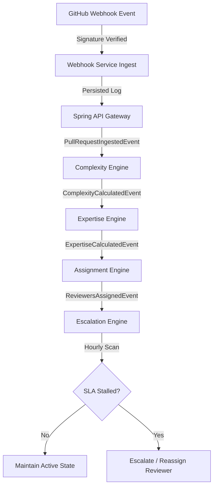
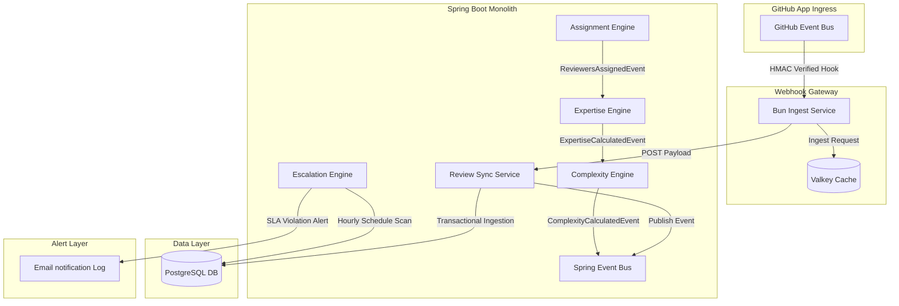
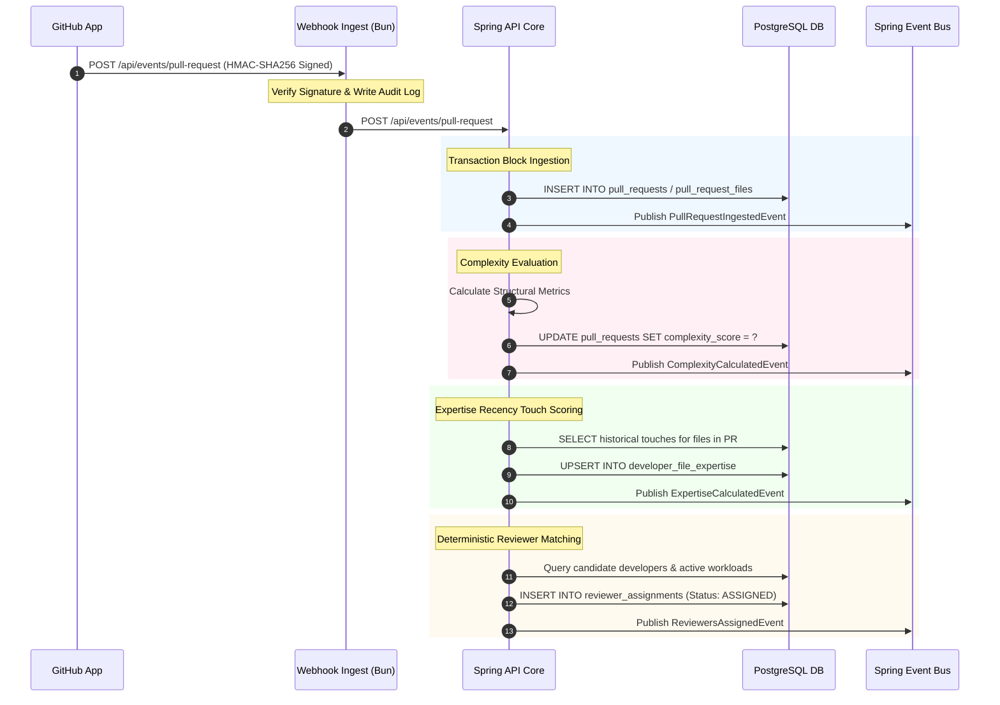
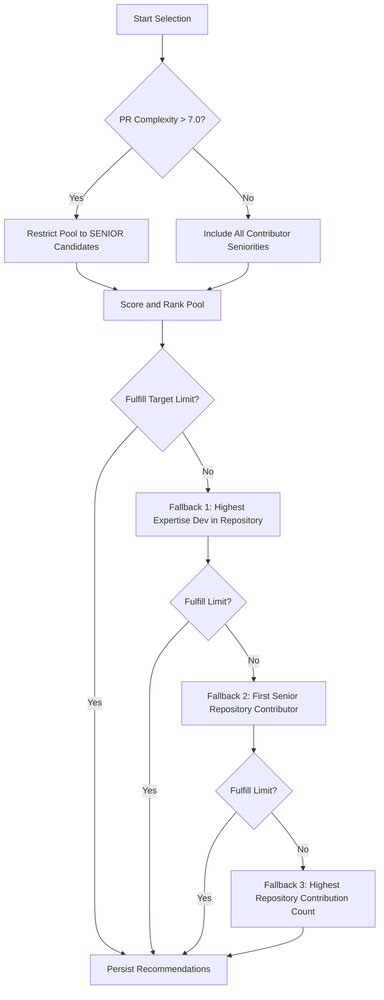
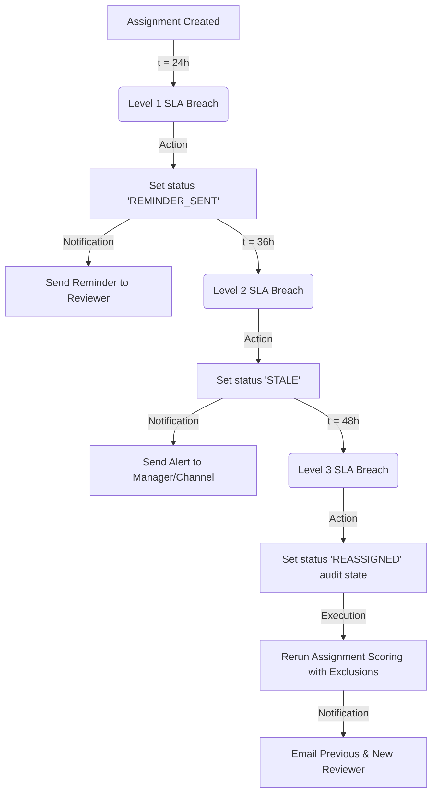

# PRFlow

**An event-driven pull request orchestration and intelligence platform for engineering organizations.**

PRFlow acts as an active workflow orchestrator and intelligence layer on top of your version control system. By tracking latency, modeling granular developer expertise, and managing reviewers dynamically, PRFlow shifts pull request routing from a passive recommendation problem into an active, self-correcting workflow control loop.

---

## ⚡ Badge Matrix

| Parameter | Specification | Status |
| :--- | :--- | :--- |
| **System Architecture** | Modular Monolith / Event-Driven | `Active` |
| **Backend Core** | Java 21 / Spring Boot 3.x | `Build Passing` |
| **Ingress Layer** | TypeScript / Bun / Express | `Build Passing` |
| **Database Persist** | PostgreSQL / Flyway | `Migrated` |
| **Cache Layer** | Valkey (Redis Compatibility) | `Active` |
| **Test Coverage** | 18 Tests Ingress-to-Escalation | `100% Success` |

---

## 📌 Problem Statement

Engineering organizations consistently experience code review bottlenecks due to a lack of structured workflow intelligence:

1. **Reviewer Overload & Asymmetry**: Standard code owner configurations route assignments naively, overloading senior developers while junior developers remain underutilized.
2. **Hidden Expertise**: Knowledge mapping is manual. An engineer's real-time expertise on specific files, directories, or modules is obscured by static domain lists.
3. **Stale Review Workflows**: Code reviews regularly stall, delaying deployments. Passive notifications fail to alert managers or self-heal the pipeline before a delivery SLA is breached.
4. **Lack of Organizational Memory**: Organizations do not track historical participation or quality latency curves, leaving knowledge distribution unquantified.

PRFlow is built to solve these systemic constraints by decoupling source code hosting from workflow orchestration.

---

## 🚀 The Core Philosophy

```
  ┌────────────────────────┐         ┌────────────────────────┐
  │   GitHub App Ingress   │         │    PRFlow Core Engine  │
  ├────────────────────────┤         ├────────────────────────┤
  │ - Git Repositories     │         │ - Workflow State       │
  │ - Source Code Storage  ├────────>│ - Expertise Graphs     │
  │ - PR Visual UI         │         │ - SLA Escalations      │
  │ - Review Sync Hook     │         │ - Deterministic Routing│
  └────────────────────────┘         └────────────────────────┘
```

GitHub acts as the system of record for repositories, file diffs, and visual reviews. **PRFlow owns the workflow intelligence layer.** 

By processing hooks, modeling developer familiarity decay curves, and executing deterministic reassignments, PRFlow maintains state orchestration independently of version control, making it highly robust and resilient to pipeline failures.

---

## 🛠️ Core Workflow Lifecycle



---

## 🏗️ Architecture Overview

The platform uses a modular monolith architecture. Real-time webhooks pass through a high-efficiency TypeScript/Bun gateway before routing to the Spring Boot core container, which manages transactional state updates, event bus publications, and database updates.



---

## ⚙️ Engine Specifications

PRFlow segments workflow logic into four deterministic, replay-safe processing engines:

### 1. Complexity Engine
* **Responsibility**: Calculates structural risk and engineering scope complexity for each ingested Pull Request.
* **Inputs**: Changed file counts, additions, deletions, and directory hierarchy depth.
* **Outputs**: `PullRequest.complexity_score`.
* **Workflow Role**: Forms the entry point of the pipeline; restricts reviewer pools for highly complex changes to senior engineers.

### 2. Expertise Engine
* **Responsibility**: Computes real-time, decayed touch and review familiarity scores across modified repository scopes.
* **Inputs**: Historic pull request touches, file paths, scopes, and review sync payloads.
* **Outputs**: Updated database entries in `developer_file_expertise` and emits `ExpertiseCalculatedEvent`.
* **Workflow Role**: Accumulates organic organizational memory. Uses touch recency weights to score candidate developers.

### 3. Assignment Engine
* **Responsibility**: Deterministically routes pull requests to optimal reviewer combinations while balancing existing capacity limits.
* **Inputs**: `ExpertiseCalculatedEvent`, excluded developer IDs (e.g. author or reassigned reviewers), and junior growth configurations.
* **Outputs**: Persisted rows in `reviewer_assignments` and emits `ReviewersAssignedEvent`.
* **Workflow Role**: Eliminates manual assignments; applies workload balancing and falls back sequentially to active contributors if needed.

### 4. Escalation Engine
* **Responsibility**: Monotors review response latency against strict SLA limits and triggers restorative workflows.
* **Inputs**: Open `reviewer_assignments` with active statuses (`ASSIGNED`, `REMINDER_SENT`, `STALE`).
* **Outputs**: SLA state transitions, email alerts, and self-healing reviewer reassignment loops.
* **Workflow Role**: Enforces organizational SLA accountability; auto-reassigns stalled PRs if delayed beyond 48 hours.

---

## 📡 Event-Driven Sequence Flow

The core workflow engine decouples transactional modules using highly efficient, synchronous internal application events to guarantee strict transactional order and crash resilience.



---

## 🗄️ Relational Database Architecture

The persistence model is structured around a PostgreSQL transactional schema managed via standard Flyway migration scripts.

```
                  ┌─────────────────┐
                  │  organizations  │
                  └────────┬────────┘
                           │ 1
                           │
                           │ *
                  ┌────────┴────────┐
                  │   developers    │
                  └────────┬────────┘
                           │ 1
                           │
                           │ *
                  ┌────────┴────────┐
                  │   assignments   │
                  └────────┬────────┘
                           │ *
                           │
                           │ 1
                  ┌────────┴────────┐
                  │  pull_requests  │
                  └─────────────────┘
```

### Table Definitions & Core Rationale

| Table Name | Core Rationale | Key Indexes |
| :--- | :--- | :--- |
| `organizations` | Defines organizational boundary matching a GitHub App installation scope. | `uq_organizations_name` |
| `developers` | Repository contributor registry tracking username, seniority, active review capacity, and reliability. | `idx_developers_org_github` |
| `repositories` | Integrates code repos mapped to their organizational boundaries. | `idx_repos_org_github_repo` |
| `pull_requests` | Tracks persistent PR lifecycle metadata (title, author, complexity, and status). | `idx_pr_repository_status` |
| `pull_request_files` | Maps changed files and domain scopes inside each pull request context. | `idx_pr_files_pr_id` |
| `developer_file_expertise` | Organic repository knowledge base tracking Touch and Review scores. | `uq_dev_repo_file_path` |
| `repository_developers` | Many-to-many relationship linking active developers to repositories. | `uq_repository_developers` |
| `reviewer_assignments` | Workflow state machine tracking deterministic score, status, SLA level, and timestamps. | `idx_reviewer_assignments_status` |
| `pull_request_reviews` | Historic record of synchronized review memory mapping GitHub IDs. | `uq_github_review_id` |

---

## 📉 Cumulative Decayed Expertise

PRFlow models developer familiarity using linear decay curves. Knowledge fades as days elapse since a developer last edited or reviewed a file.

### Familiarity Touch Decayed Decay Parameters
The touch score weight is calculated relative to the Pull Request `opened_at` timestamp:

$$\text{Weight} = \begin{cases} 
      1.0 & \text{touch } < 30 \text{ days ago} \\
      0.7 & 30 \text{ days} \le \text{touch } \le 90 \text{ days ago} \\
      0.4 & 90 \text{ days} < \text{touch } \le 180 \text{ days ago} \\
      0.1 & \text{touch } > 180 \text{ days ago}
   \end{cases}$$

### Review Scores
Synced review actions represent active intellectual contributions and increment a developer's expertise memory:

$$\text{ReviewScore} = \text{Participation} \times 1.0 + \text{Approval} \times 2.0$$

---

## 🎯 Reviewer Routing Heuristics

The Assignment Engine ranks and selects reviewers using a deterministic multi-stage calculation:

### 1. The scoring Formula
To balance workloads and avoid senior engineer burnout, a developer's expertise is decayed dynamically by their active PR review burden:

$$\text{Score} = \frac{\text{ExpertiseScore}}{1.0 + (\text{ActiveReviewsCount} \times 2.0)}$$

*Note: ActiveReviewsCount only counts active open assignments with status `ASSIGNED`, `REMINDER_SENT`, or `STALE`.*

### 2. Multi-Stage Filtering & Fallback



---

## ⏱️ SLA Escalation Engine (V1)

Active workflow review latency is monitored by an hourly scheduled scanner evaluating assignments against three progressive SLA breach tiers.



---

## 🛡️ Transactional Idempotency & Replay Safety

To guarantee absolute data integrity under concurrent webhook delivery retries or network drops, PRFlow applies several rigorous idempotency models:

1. **State Machine Lockouts**: SLA scheduler transitions update the database conditionally using atomic gates:
   ```sql
   UPDATE reviewer_assignments 
   SET assignment_status = 'REMINDER_SENT', reminder_sent_at = NOW(), escalation_level = 1 
   WHERE pull_request_id = ? AND developer_id = ? 
     AND escalation_level < 1 AND assignment_status = 'ASSIGNED';
   ```
   If a scheduler scan is executed multiple times concurrently, exactly one update will succeed, preventing duplicate notification dispatches.
2. **Review Synchronization Replay Gating**: Before storing reviews, `ReviewSyncService` checks historical hashes. If a review with an identical state already exists, the event is immediately ignored as a processed replay.
3. **Audit Log Ingress**: A dedicated `webhook_logs` table serves as a cryptographic record of all ingested request payloads, validating signatures and ensuring duplicate messages are detected at the boundary.

---

## 📈 System Status Roadmap

### Implemented Core Infrastructure
- [x] Cryptographic GitHub App Webhook Signature Verification.
- [x] Transactional Webhook Ingest & Persistence Audits.
- [x] File Changed Extraction & Code Scope Parser.
- [x] Foundational Touch Recency Decayed Expertise Calculations.
- [x] Complexity Metric Analyzer & Senior Complexity Gating.
- [x] Capacity-Aware Reviewer Assignment Engine.
- [x] SLA Escalation Engine (V1) supporting Reminder, Stale, and self-healing Reassignments.
- [x] Synchronized GitHub Review Memory Upserts and Completion Loops.

### Architectural Roadmap (Realistic Extensions)
- **Review Latency Insights**: Build historic trends tracking avg cycle time per reviewer, complexity, and repository.
- **Ownership Heatmaps**: Map file directories to knowledge concentration indexes to expose bottlenecks and single-points-of-failure.
- **Workload Forecasting**: Predictive capacity charts estimating future reviewer bottleneck limits based on current branch activity.

---

## 💻 Local Development Setup

Follow these steps to run a fully operational local instance of PRFlow.

### Prerequisites
- **Java Development Kit (JDK 21)**
- **Bun** (Fast TS runtime)
- **Docker & Docker Compose**

### 1. Bootstrap Database & Valkey
Spin up the backing persistence layers using local definitions:
```bash
docker run -d --name prflow-db -p 5432:5432 -e POSTGRES_DB=prflow_db -e POSTGRES_USER=prflow_app -e POSTGRES_PASSWORD=change_me_in_local_env postgres:16
docker run -d --name prflow-valkey -p 6379:6379 valkey/valkey:8.0
```

### 2. Start the Backend API (Spring Boot)
Build and run the central orchestration monolithic engine:
```bash
cd backend/spring-api
mvn compile
mvn spring-boot:run -Dspring-boot.run.arguments="--spring.datasource.password=change_me_in_local_env"
```
The database migrations will execute automatically through Flyway on startup.

### 3. Start the Webhook Ingress Gateway
Install package dependencies and start the hot-reloading development server:
```bash
cd integrations/github-webhook-service
bun install
bun run dev
```

### 4. Wire Up GitHub App Integration
To test the end-to-end webhook sync loop:
1. Create a GitHub App in your organization settings.
2. Set the Webhook URL to your public gateway (e.g. expose port `3001` via `ngrok http 3001`).
3. Set the Webhook Secret key matching your gateway configuration.
4. Set required repository permissions: `Pull Requests: Read & Write`, `Metadata: Read-Only`.
5. Generate a private key file, place it in the configuration folder, and link it in the environment vars.

---

## 🗂️ Monorepo Structure

```
.
├── backend/spring-api/        # Core Java 21/Spring Boot Orchestration Monolith
│   ├── src/main/java/         # Core transactional engines, services, and db gateways
│   └── src/main/resources/    # Schema flyway migrations and configurations
├── integrations/
│   └── github-webhook/        # TypeScript/Bun Webhook Ingestion Service
├── docs/                      # Technical specification manuals
│   ├── engines/               # Engine guides (Complexity, Escalation, Reviews)
│   └── database/              # Schema design guides
├── infra/                     # Infrastructure configurations
└── README.md                  # System Documentation Guide
```

---

## 🧭 Contribution Manifesto

PRFlow is built for durability. Contributors should adhere strictly to the following parameters:

1. **Architecture-First Development**: Design your changes with decoupled, single-responsibility boundaries. Never couple engine logic to the visual GitHub API hooks directly.
2. **Maintain State Safety**: All database updates must use transaction isolation boundaries and support idempotent replays.
3. **No Fluff**: We do not include AI model wrappers, static heuristic layers, or complex multi-microservice dependencies. Keep the system clean, simple, and hyper-reliable.
