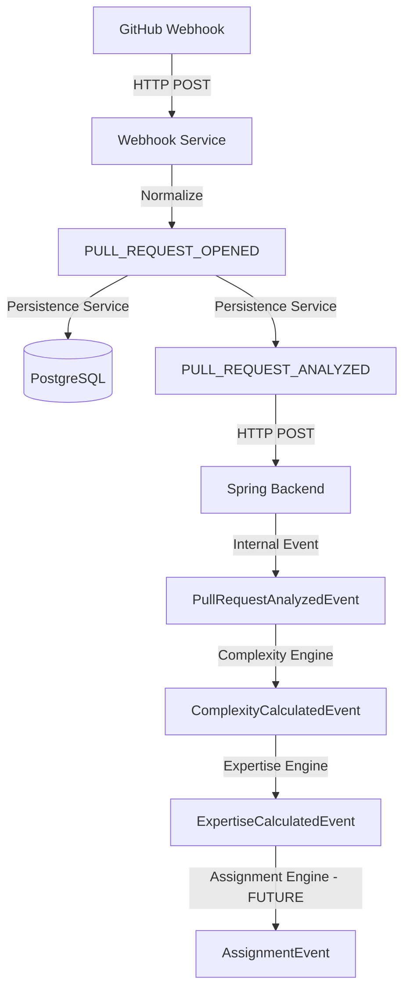

# Event-Driven Orchestration Analysis - PRFlow

## 1. Orchestration Flow (End-to-End)

The PRFlow orchestration pipeline is a multi-stage, event-driven process that spans two services:

1.  **Ingress (Webhook Service)**:
    *   Receives GitHub Webhook.
    *   **Normalizer**: Converts raw JSON to a `PrflowEvent` (e.g., `PULL_REQUEST_OPENED`).
    *   **Dispatcher**: Publishes event to internal in-memory handlers.
2.  **Workflow Persistence (Webhook Service)**:
    *   `PullRequestPersistenceService` handles `PULL_REQUEST_OPENED`.
    *   Fetches file diffs from GitHub API.
    *   Writes PR and File data to PostgreSQL.
    *   Publishes `PULL_REQUEST_ANALYZED` event (containing DB IDs).
3.  **Cross-Service Forwarding**:
    *   `PullRequestAnalyzedHandler` (Webhook Service) POSTs the event to the Spring Backend.
4.  **Intelligence Enrichment (Spring Backend)**:
    *   `PullRequestEventController` publishes a Spring `PullRequestAnalyzedEvent`.
    *   **Complexity Engine**: Listens for `PullRequestAnalyzedEvent`, calculates scores, persists them, and emits `ComplexityCalculatedEvent`.
    *   **Expertise Engine**: Listens for `ComplexityCalculatedEvent`, updates author expertise, finds candidate reviewers, and emits `ExpertiseCalculatedEvent`.

## 2. Event Dependency Graph

## 3. Orchestration Characteristics

*   **Idempotency & Replay Safety**:
    *   `ComplexityService` uses `FOR UPDATE` locks and checks `complexity_calculated_at` to prevent double-processing.
    *   The Webhook Service uses advisory locks during PR persistence.
*   **Isolation**:
    *   The **Integration Layer** (Webhook Service) is isolated from **Intelligence Engines** (Spring Backend).
    *   Engines communicate via events, not direct service calls, allowing for easy expansion (e.g., adding a "Security Engine" that listens to `PULL_REQUEST_ANALYZED`).
*   **Chaining**:
    *   Enrichment is strictly chained: Complexity -> Expertise -> (Future) Assignment. This ensures that downstream engines have the intelligence data they need from upstream ones.

## 4. Risks & Limitations
*   **Coupling**: While events decouple the logic, the strict chaining means a failure in the Complexity Engine blocks the Expertise Engine.
*   **In-Memory Dispatcher**: The webhook service uses an `InMemoryEventDispatcher`. If the process crashes after persistence but before publishing `PULL_REQUEST_ANALYZED`, the event is lost. A persistent message queue (e.g., RabbitMQ, Postgres-based Queue) would be needed for true reliability.
