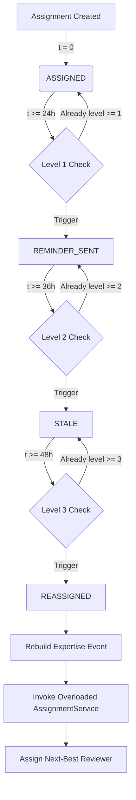

# Escalation Engine (V1) Architectural Guide

The **Escalation Engine (V1)** introduces active workflow SLA orchestration to PRFlow. It transforms the platform from a passive reviewer recommendation engine into an active, self-correcting workflow coordinator by monitoring reviewer response latency, detecting staleness, dispatching notifications, and executing deterministic reassignments when reviewers stall.

---

## 🏗️ Architecture Overview

The Escalation Engine is designed under three core principles:
1. **Deterministic Multi-Level Escalation**: Response SLAs are partitioned into progressive chronological thresholds ($24\text{h}$, $36\text{h}$, and $48\text{h}$).
2. **Replay Safety & Strict Idempotency**: Status transitions act as a one-way state machine, guarded by database indexes and conditional updates to guarantee that scheduler replays never produce duplicate alerts or cascading reassignment loops.
3. **Mock Integration Foundation**: All alerts use a provider-agnostic, zero-dependency notification layer writing high-fidelity structured mail envelopes to the log stream.



---

## 🗄️ Database & Schema States

Active reviewer assignments undergo strict state machine transitions in the `reviewer_assignments` table:

```sql
ALTER TABLE reviewer_assignments
    ADD COLUMN assignment_status VARCHAR(50) DEFAULT 'ASSIGNED' NOT NULL,
    ADD COLUMN escalated_at TIMESTAMP,
    ADD COLUMN reminder_sent_at TIMESTAMP,
    ADD COLUMN reassigned_at TIMESTAMP,
    ADD COLUMN escalation_level INT DEFAULT 0 NOT NULL;
```

### State Machine Transitions

| Origin State | Destination State | Trigger Condition | Escalation Level | Timestamps Populated | Events Emitted |
| :--- | :--- | :--- | :--- | :--- | :--- |
| `ASSIGNED` | `REMINDER_SENT` | Wait duration $\ge 24\text{h}$ | `1` | `reminder_sent_at = now()` | `ReviewReminderSentEvent` |
| `REMINDER_SENT` | `STALE` | Wait duration $\ge 36\text{h}$ | `2` | `escalated_at = now()` | `PullRequestStaleEvent` |
| `STALE` | `REASSIGNED` | Wait duration $\ge 48\text{h}$ | `3` | `reassigned_at = now()` | `ReviewerReassignedEvent` |
| `ASSIGNED`/`REMINDER_SENT`/`STALE` | `COMPLETED` | Review synchronized from GitHub | Unchanged | `updated_at = now()` | *None* |

---

## ⚡ Multi-Level SLA Execution

### Level 1: Reviewer Reminder (24h+)
* **Objective**: Prod the assigned reviewer to look at the pull request before bottleneck alerts are raised.
* **Notification**: Generates structured mock email dispatched to `<username>@company.com`.
* **Database State**: Status $\rightarrow$ `REMINDER_SENT`, level $\rightarrow$ `1`, `reminder_sent_at` $\rightarrow$ `now()`.
* **Event**: Emits `ReviewReminderSentEvent`.

### Level 2: Stale Alert (36h+)
* **Objective**: Alert managers and the team channel about a potential review bottleneck.
* **Notification**: Generates bottleneck warning email dispatched to `<username>-manager@company.com`.
* **Database State**: Status $\rightarrow$ `STALE`, level $\rightarrow$ `2`, `escalated_at` $\rightarrow$ `now()`.
* **Event**: Emits `PullRequestStaleEvent`.

### Level 3: Reassignment (48h+)
* **Objective**: Self-heal the review bottleneck by unassigning the stalled reviewer and matching the PR with the next-best qualified candidate.
* **Execution Flow**:
  1. Transition old assignment to `REASSIGNED` (non-active audit state).
  2. Query pull request changed files.
  3. Aggregate `developer_file_expertise` records to rebuild `ExpertiseCalculatedEvent` from scratch.
  4. Invoke `AssignmentService.assignReviewers(event, List.of(stalledReviewerId))` with explicit exclusions.
  5. The Assignment Engine calculates remaining slots (`remainingLimit = targetLimit - activeReviewers`), excludes the author and stalled developer, runs standard and fallback selection logic, and inserts the new assignee under `ASSIGNED` status.
  6. Email both previous and new developers informing them of the shift.
  7. Emit `ReviewerReassignedEvent`.

---

## 🧪 Verification & Operational Guidelines

### Automated Testing
Unit tests reside in [EscalationServiceTest.java](file:///home/an/Desktop/dev/prflow/backend/spring-api/src/test/java/prflow/spring_backend/engines/escalation/EscalationServiceTest.java) and verify:
- Chronological triggers at exactly 25h, 37h, and 50h wait durations.
- 100% replay-safe behavior ensuring already-processed levels are skipped immediately.
- Clean integration with the overloaded Assignment Service and mock Notification dispatch.

Run the tests using:
```bash
mvn test -Dtest=EscalationServiceTest
```

### SQL Diagnostic Query
Operators can query current SLA states across all PR assignments using:
```sql
SELECT 
    pr.title AS pr_title,
    d.username AS reviewer,
    ra.assignment_status,
    ra.escalation_level,
    ra.created_at,
    ra.reminder_sent_at,
    ra.escalated_at,
    ra.reassigned_at
FROM reviewer_assignments ra
JOIN pull_requests pr ON ra.pull_request_id = pr.id
JOIN developers d ON ra.developer_id = d.id
ORDER BY ra.created_at DESC;
```
